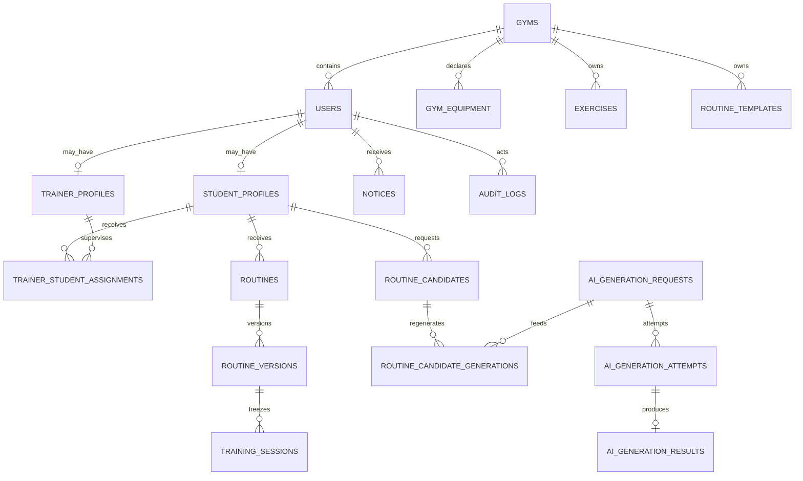
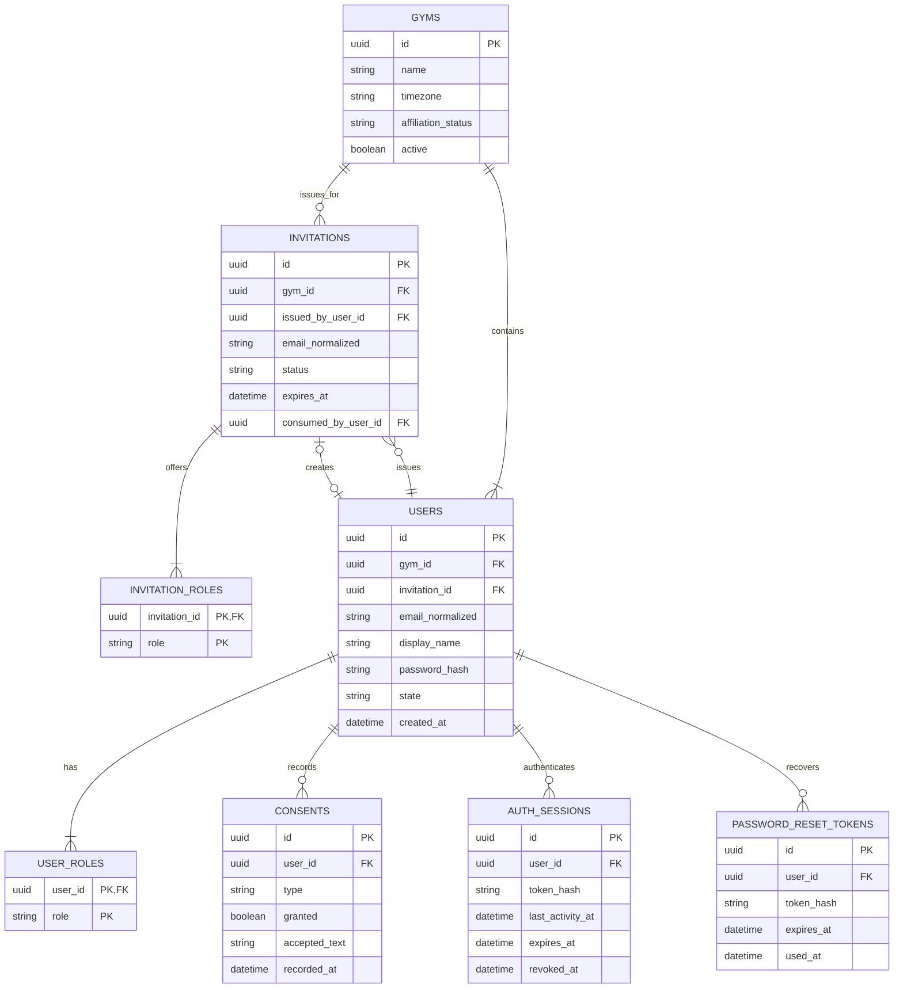
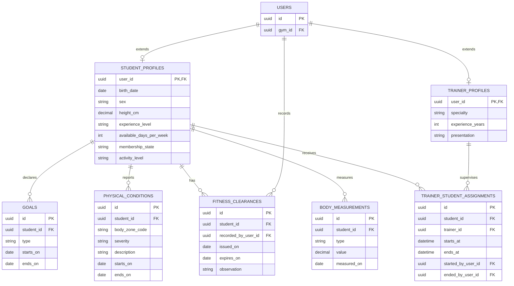
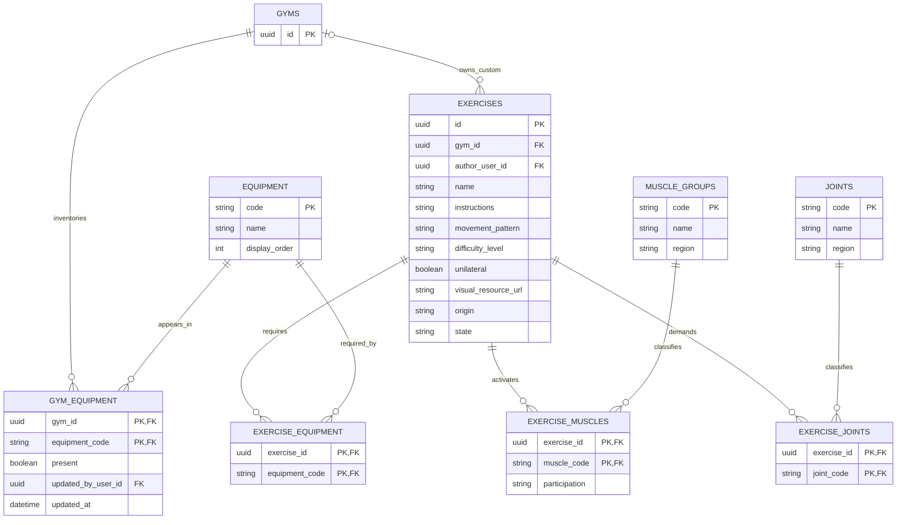
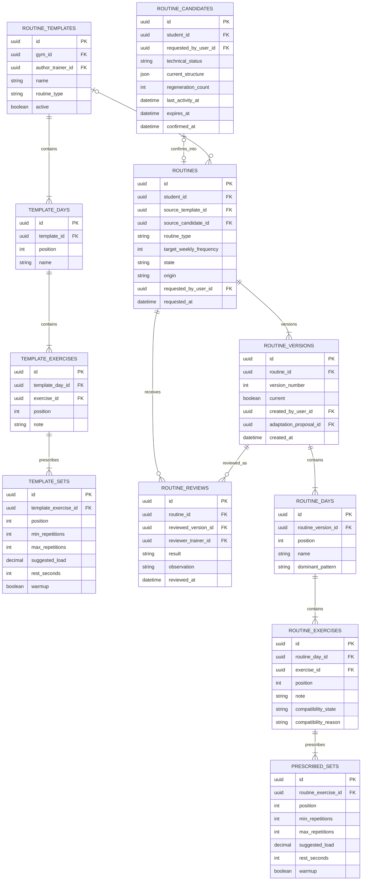
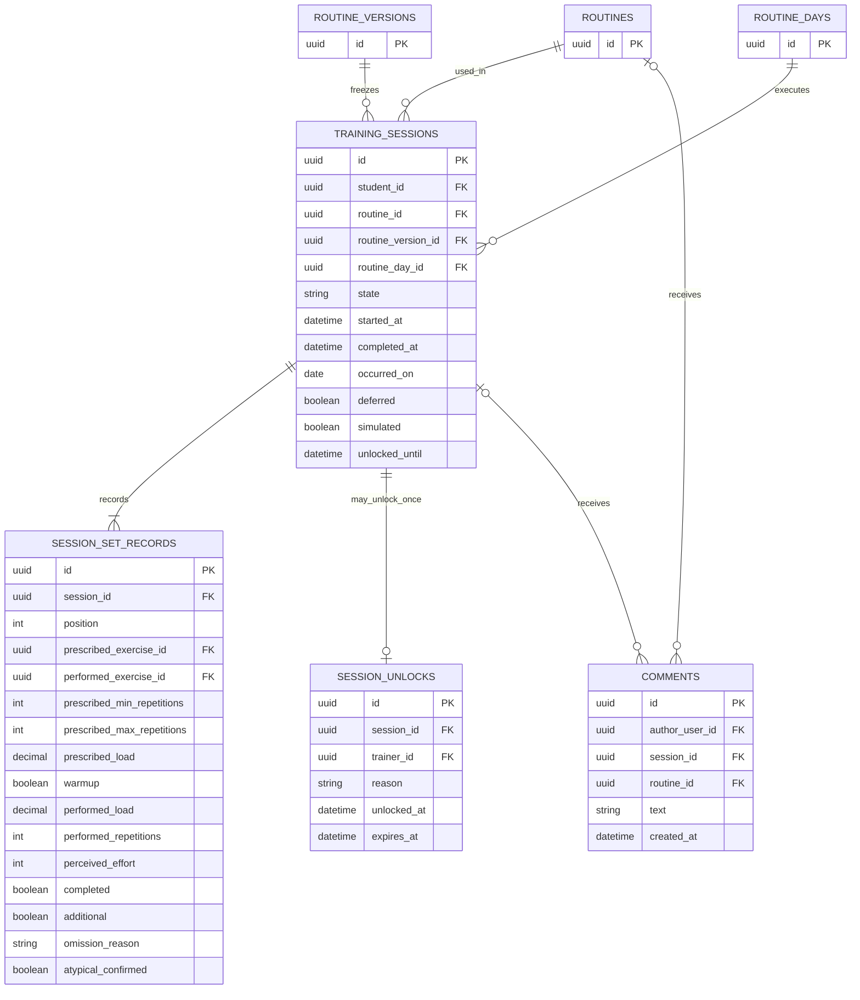
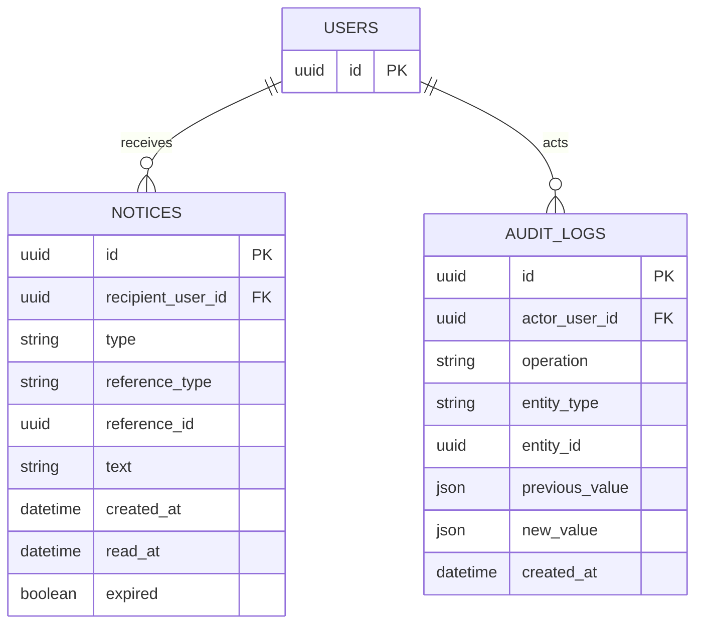
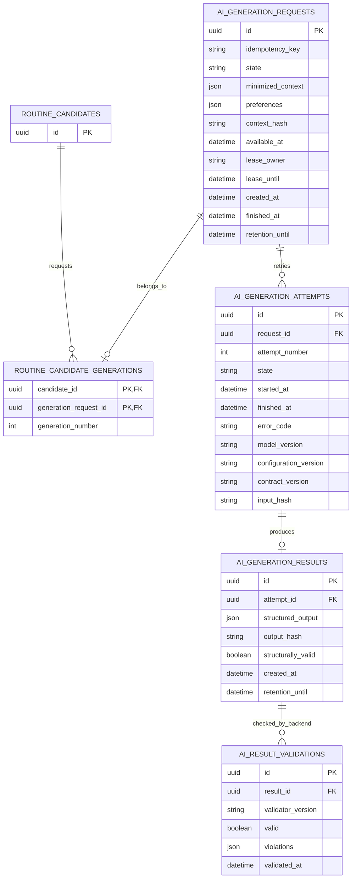
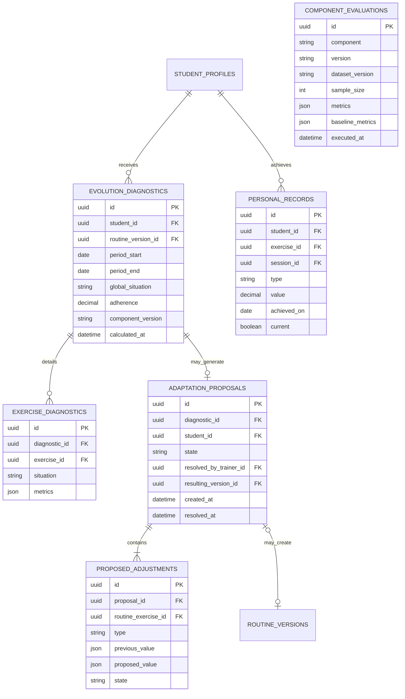

# Modelo relacional de PostgreSQL

**Estado:** propuesto para revisión · **Fecha:** 2026-09-01

## Alcance y autoridad

Este documento traduce el [modelo de dominio](../domain/domain-model.md) a una estructura relacional implementable en PostgreSQL 17. El dominio, las enumeraciones y los ciclos de vida continúan definidos exclusivamente por D2, D4, D5 y D6; aquí se definen tablas, claves, relaciones, restricciones e interfaces de acceso.

El backend es dueño de Prisma, del esquema y de todas las migraciones. El servicio IA sólo accede a las tablas del esquema `ai_integration` que se le concedan explícitamente.

## Decisiones de modelado

- Usar `uuid` con `gen_random_uuid()` para claves primarias y `timestamptz` para instantes.
- Usar `date` para fechas del dominio y `numeric` para medidas, cargas y valores que no deben perder precisión.
- Usar nombres `snake_case`, claves foráneas explícitas y `created_at`/`updated_at` donde corresponda.
- Representar estados y enumeraciones cerradas mediante enums de Prisma/PostgreSQL; equipamiento, grupos musculares y articulaciones son tablas de referencia porque además tienen nombre, región y orden de presentación.
- Mantener las entidades transaccionales normalizadas. Reservar `jsonb` para snapshots técnicos de IA, explicaciones, métricas y auditoría, no para relaciones centrales.
- No borrar físicamente usuarios, ejercicios, plantillas, rutinas ni sesiones con historia. Se cambia su estado o se anonimizan los datos personales.
- Crear dos esquemas PostgreSQL en esta entrega:
  - `app`: fuente de verdad transaccional, accesible sólo por backend y migraciones;
  - `ai_integration`: cola durable y resultados técnicos, con permisos mínimos para backend e IA.
- No crear el esquema `analytics` en esta entrega. Si posteriormente se aprueba la etapa analítica, se incorporará mediante una migración específica junto con sus tablas y permisos.

### Distribución física por esquema

- `app` contiene las 40 tablas transaccionales de las secciones 1 a 6 y `routine_candidate_generations`, que asocia un candidato del dominio con una solicitud técnica sin exponer el candidato al servicio IA: 41 tablas en total.
- `ai_integration` contiene únicamente `ai_generation_requests`, `ai_generation_attempts`, `ai_generation_results` y `ai_result_validations`.
- Backend y el rol de migraciones operan sobre ambos esquemas. El servicio IA recibe permisos mínimos sólo sobre las tablas necesarias de `ai_integration` y ningún permiso sobre `app`.

## Vista general

## 1. Gimnasio, identidad y acceso

Restricciones principales:

- `users`: `UNIQUE (gym_id, email_normalized)`.
- `users.invitation_id`: único y anulable sólo para el primer administrador aprovisionado.
- `invitation_roles` y `user_roles`: clave primaria compuesta.
- Toda invitación vence a los 14 días y produce como máximo un usuario.
- Los tokens se guardan hasheados; nunca se almacena el valor utilizable.
- La aplicación impide eliminar el último rol de un usuario y el último administrador activo del gimnasio.

## 2. Perfiles y relación entrenador–alumno

Restricciones principales:

- Índice único parcial en `goals (student_id) WHERE ends_on IS NULL`.
- Índice único parcial en `trainer_student_assignments (student_id) WHERE ends_at IS NULL`.
- `trainer_id <> student_id`.
- `body_measurements`: `UNIQUE (student_id, type, measured_on)`.
- Toda fecha de fin debe ser posterior a la de inicio.
- Los perfiles sólo existen si el usuario posee el rol correspondiente; esta invariante se valida transaccionalmente en backend.

## 3. Inventario y catálogo de ejercicios

Restricciones principales:

- `exercises.gym_id IS NULL` sólo cuando `origin = 'CATALOGO_BASE'`; un ejercicio propio siempre informa gimnasio y autor.
- `UNIQUE (gym_id, lower(name))` para ejercicios propios; el catálogo base usa un índice equivalente con `gym_id IS NULL`.
- Índice único parcial en `exercise_muscles (exercise_id) WHERE participation = 'PRIMARIA'`.
- `PESO_CORPORAL` se carga como equipamiento de referencia y se considera siempre presente.
- Un ejercicio no se borra: pasa a `DESACTIVADO` y permanece referenciable por el historial.

## 4. Plantillas, candidatos y rutinas

`routine_candidates` es almacenamiento técnico temporal, no una rutina ni un nuevo estado de `routines`. En la primera entrega sólo representa candidatos generados por IA: los presets son alcance opcional y no agregan tablas ni columnas hasta que se decida implementarlos. Conserva el snapshot ajustable para recuperar el flujo y reconstruir diferencias. Al confirmar, el backend crea en una transacción `routines`, `routine_versions`, días, ejercicios y series.

Un candidato usa los estados técnicos `ACTIVO`, `CONFIRMADO` y `ABANDONADO`. Mientras está activo expira después de 24 horas sin actividad; cada ajuste o regeneración actualiza `last_activity_at` y `expires_at`. Al confirmarlo se conservan identificador, solicitante, solicitudes y resultados generativos relacionados, cantidad de regeneraciones e instantes. La estructura final vive únicamente en las tablas relacionales de la rutina.

Restricciones principales:

- Orden único dentro de cada plantilla, día, versión y ejercicio.
- Una plantilla debe pertenecer al mismo gimnasio que su autor.
- `routine_candidates.regeneration_count BETWEEN 0 AND 3`.
- `routine_candidates.expires_at = last_activity_at + interval '24 hours'` mientras el candidato esté `ACTIVO`.
- Índices únicos parciales separados para una rutina `PROPUESTA` y una `VIGENTE` por alumno.
- `UNIQUE (routine_id, version_number)` e índice único parcial en `routine_versions (routine_id) WHERE current`.
- Una revisión favorable sólo puede crear o activar una versión si el revisor tiene una asignación vigente con el alumno.
- Toda rutina conserva copia profunda; modificar una plantilla nunca modifica una rutina existente.

## 5. Sesiones y prescripción congelada

Al iniciar una sesión se crean los `session_set_records` copiando la prescripción vigente. Los campos prescriptos y ejecutados permanecen juntos para que el historial no dependa de cambios posteriores.

Restricciones principales:

- Índice único parcial en `training_sessions (student_id) WHERE state = 'EN_CURSO'`.
- `UNIQUE (session_id, position)` en registros de serie.
- `UNIQUE (session_id)` en `session_unlocks`: una sesión sólo se desbloquea una vez.
- `perceived_effort BETWEEN 1 AND 10` cuando se informa.
- Un comentario referencia exactamente una sesión o una rutina mediante un `CHECK` exclusivo.
- La prescripción copiada en una sesión no se actualiza después de crearla.

## 6. Avisos y auditoría transaccional

Ambas tablas pertenecen a `app`: los avisos forman parte de la experiencia transaccional del usuario y la auditoría registra operaciones sensibles del backend. Ninguna es una salida analítica ni debe ser accesible por el servicio IA.

Restricciones principales:

- Los tipos de aviso usan la enumeración cerrada de D2.
- La no repetición, caducidad y reasignación de avisos siguen las reglas de RF-095 y D5.
- La auditoría cubre las operaciones sensibles enumeradas en RF-097.

## 7. Interfaz durable Backend–IA

`routine_candidate_generations` pertenece físicamente a `app`; las otras cuatro tablas del diagrama pertenecen a `ai_integration`. El backend administra la asociación y el servicio IA no recibe permisos para leer candidatos ni sus identificadores.

Estados técnicos aceptados:

- solicitud: `PENDIENTE`, `PROCESANDO`, `COMPLETADA`, `NO_DISPONIBLE`, `CANCELADA`;
- intento: `PENDIENTE`, `PROCESANDO`, `COMPLETADO`, `FALLIDO`, `AGOTADO_POR_TIEMPO`, `SALIDA_INVALIDA`.

Estos estados se incorporan a D6 antes de implementar la migración.

### Contratos JSON versionados

Los campos `jsonb` no admiten estructuras libres. Sus contratos se publican en el OpenAPI del servicio IA y se validan con Pydantic en Python y Zod en backend.

- `minimized_context`: `schema_version`, objetivo, nivel de experiencia, frecuencia, condiciones físicas pertinentes sin texto identificatorio, equipamiento disponible y catálogo permitido. No contiene identificador de usuario, nombre, correo, teléfono, documento ni credenciales.
- `preferences`: `schema_version`, ejercicios excluidos, patrones preferidos y observaciones sanitizadas que aporten a la generación.
- `structured_output`: `schema_version`, tipo, frecuencia objetivo, días ordenados, ejercicios identificados por el catálogo, series, repeticiones, carga opcional, descanso, calentamiento y explicación.

Cada intento registra además `contract_version`, hashes de entrada y salida, versión del modelo y versión de configuración. Un cambio incompatible crea una versión nueva del contrato; nunca se interpreta silenciosamente un JSON viejo como si fuera nuevo.

Reglas de acceso:

- Backend crea solicitudes y candidatos, consulta estados, valida resultados y convierte un candidato confirmado en rutina.
- IA puede leer y reclamar solicitudes pendientes, actualizar su lease, insertar intentos y resultados y cerrar el estado técnico.
- IA no recibe permisos sobre `app.users`, perfiles, rutinas, sesiones ni aprobaciones.
- `minimized_context` no contiene nombre, correo, teléfono, documento, credenciales ni URLs de base.
- La elección Test/Producción ocurre por conexión y credencial del servicio, nunca por un campo enviado por el cliente.

Restricciones principales:

- `UNIQUE (idempotency_key)` por base de datos.
- `UNIQUE (request_id, attempt_number)` y `attempt_number BETWEEN 1 AND 2`.
- `UNIQUE (attempt_id)` en resultados.
- Reclamo mediante `SELECT ... FOR UPDATE SKIP LOCKED` y lease recuperable; un reinicio del worker no pierde el trabajo.
- Sólo un resultado validado favorablemente puede alimentar un candidato visible.
- Fallos, abandonos y respuestas inválidas se purgan a los 30 días; resultados aceptados conservan lo necesario para reproducibilidad y auditoría.

## 8. Modelo futuro de adaptación y analítica — fuera de esta entrega

No se crearán tablas analíticas en esta entrega. El siguiente modelo queda únicamente como dirección futura y no forma parte de las primeras migraciones:

Las salidas analíticas son append-only: cada cálculo inserta un registro nuevo con versión e instante. El valor vigente es el más reciente; nunca se sobrescribe el pasado.

`risk_scores` no forma parte del modelo porque RF-061 a RF-063 están en estado WON'T. `profile_segments` tampoco se persiste: RF-064 define una descripción generativa efímera. Avisos y auditoría pertenecen al esquema transaccional `app` y están definidos en la sección 6.

## 9. Orden de migraciones recomendado

1. Esquemas, extensiones necesarias, enums y tablas de referencia.
2. Gimnasio, invitaciones, usuarios, roles, sesiones de autenticación y consentimientos.
3. Perfiles, objetivos, condiciones, aptitudes, mediciones y asignaciones.
4. Inventario, ejercicios y clasificaciones.
5. Plantillas, candidatos, rutinas, versiones y revisiones.
6. Sesiones, registros congelados, comentarios y desbloqueos.
7. Avisos y auditoría transaccional en `app`.
8. Interfaz durable `ai_integration`, asociación de candidatos en `app` y permisos mínimos del rol IA.

Diagnósticos, propuestas, récords e indicadores analíticos quedan para una etapa posterior y no crean el esquema `analytics` en estas migraciones.

Cada paso se crea como una migración Prisma revisada y comprobada sobre PostgreSQL efímero antes de promoverse a Neon Test.

## 10. Población inicial en Neon Test

El SQL Editor puede utilizarse para cargar datos de referencia y prueba después de que CI haya aplicado las migraciones. No debe utilizarse para crear manualmente tablas que Prisma desconozca.

Orden de carga:

1. `equipment`, `muscle_groups` y `joints`, usando literalmente las enumeraciones de D2.
2. Un gimnasio de prueba y su primer administrador mediante un procedimiento de aprovisionamiento transaccional.
3. Inventario del gimnasio.
4. Catálogo base de ejercicios y sus relaciones de equipamiento, músculos y articulaciones.
5. Usuarios ficticios, asignaciones y perfiles.
6. Plantillas privadas de entrenadores. No se cargan presets en esta entrega.

Todo script de carga debe ser idempotente (`INSERT ... ON CONFLICT ...`) y versionarse en backend. Neon Producción sólo recibe datos de referencia revisados; nunca se copian usuarios ni datos de Test.

## 11. Decisiones cerradas para la primera entrega

1. Se crean únicamente los esquemas `app` y `ai_integration`; `analytics` queda fuera de esta entrega.
2. Solicitudes e intentos de IA usan los estados técnicos aceptados en la sección 7.
3. Un candidato activo vence después de 24 horas sin actividad y cada operación renueva el plazo.
4. Contexto, preferencias y salida usan contratos JSON versionados, sin datos identificatorios.
5. La autenticación usa sesiones propias; se conservan `auth_sessions` y `password_reset_tokens`.
6. No se crean tablas analíticas en esta entrega.
7. Los presets son opcionales: no se modelan ni migran salvo que el cronograma permita incorporarlos posteriormente.
