# Secuencias de la implementación actual

```yaml
document_id: ARCH-IMPLEMENTED-SEQUENCES
status: as-built-reference
snapshot_date: 2026-09-21
branches_reviewed:
  frontend: develop
  backend: develop
  ai: develop
normative: false
contains_future_design: false
```

## Propósito y regla de lectura

Este documento permite construir o renderizar diagramas de secuencia de lo que existe en el código actual. No sustituye los flujos funcionales normativos de [functional-flows.md](../flows/functional-flows.md) ni afirma que una tabla existente equivalga a una funcionalidad implementada.

Clasificación usada:

- `E2E`: existe recorrido frontend → backend → PostgreSQL y está expuesto en una pantalla funcional.
- `API`: existe en backend pero frontend no lo consume.
- `COMPONENTE`: existe de forma aislada, pero no completa un recorrido entre repositorios.
- `ROTO`: los componentes existen, pero sus contratos actuales no son compatibles.
- No se documentan como implementadas las pantallas `PlaceholderPage`, los datos visuales hardcodeados ni las tablas sin endpoint/caso de uso.

## Participantes comunes

```text
Usuario        persona que opera la SPA o un cliente HTTP
Frontend       React + TanStack Query + Zod
API            Express; controllers y middleware HTTP
Auth           sesión propia mediante cookie httpOnly y roles persistidos
UseCase        caso de uso de aplicación del backend
Repository     adaptador Prisma del backend
DB             Neon PostgreSQL; schemas app y ai_integration
AI API         FastAPI desplegada en Vercel
Queue          Vercel Queues
Worker         consumidor Python de generación
LLM            Ollama en el Polo mediante Cloudflare Tunnel
LocalStorage   estado local del navegador; no es fuente de verdad de negocio
```

La autenticación pública usa sesiones propias. El frontend nunca elige ni simula una identidad: inicia sesión, conserva sólo la identidad pública en TanStack Query y envía la cookie `httpOnly` mediante `credentials: include`. Backend resuelve usuario, gimnasio y roles desde `auth_sessions`; las cabeceras `x-user-*` quedan limitadas al proceso de pruebas automatizadas (`NODE_ENV=test`). La autenticación backend–IA usa un secreto de servicio independiente y nunca debe originarse en frontend.

## Matriz de cobertura

| ID | Secuencia | Estado | Entrada frontend |
| --- | --- | --- | --- |
| SEQ-00 | Iniciar, recuperar y cerrar sesión | E2E | `/ingresar` y guardas de rutas |
| SEQ-01 | Consultar rutina vigente y aviso de renovación | E2E | `/alumno` |
| SEQ-02 | Consultar cartera priorizada del entrenador | E2E | `/entrenador`, `/entrenador/alumnos`, `/entrenador/rutinas` |
| SEQ-03 | Consultar ficha y rutina resumida de un alumno | E2E | `/entrenador/alumnos/:studentId` |
| SEQ-04 | Desbloquear alumno con medición adeudada | E2E | ficha del alumno bloqueado |
| SEQ-05 | Listar y abrir propuestas de adaptación | E2E | `/entrenador/rutinas/revisar` |
| SEQ-06 | Resolver propuesta de adaptación | E2E | `/entrenador/rutinas/revisar/:proposalId` |
| SEQ-07 | Evaluar y aplicar bloqueo por inactividad | API | sin pantalla |
| SEQ-08 | Consultar y finalizar una generación | E2E | ficha del alumno del entrenador |
| SEQ-09 | Solicitar generación desde backend | E2E | ficha del alumno del entrenador |
| SEQ-10 | Despachar y procesar generación dentro de IA | COMPONENTE | no accesible desde frontend |
| SEQ-11 | Reintentar o agotar una generación IA | COMPONENTE | no accesible desde frontend |
| SEQ-12 | Comprobar salud y dependencias | API/COMPONENTE | sin pantalla |

## SEQ-00 — Inicio de sesión, recuperación y autorización de área

```mermaid
sequenceDiagram
    autonumber
    actor Usuario
    participant FE as Frontend React
    participant API as Backend Express
    participant Auth as Login/ResolveSession
    participant Repo as PrismaAuthRepository
    participant DB as PostgreSQL app
    participant Browser as Cookie jar

    Usuario->>FE: Abre la aplicación
    FE->>API: GET /auth/me<br/>credentials: include
    alt no existe sesión válida
        API-->>FE: 401 unauthorized
        FE-->>Usuario: Muestra /ingresar
        Usuario->>FE: Correo + contraseña
        FE->>API: POST /auth/login<br/>credentials: include
        API->>Auth: Normalizar correo y verificar bcrypt
        Auth->>Repo: Buscar credenciales y roles
        Repo->>DB: users + user_roles
        alt credenciales inválidas o cuenta no ACTIVO
            API-->>FE: 401 invalid_credentials
            FE-->>Usuario: Error genérico
        else credenciales válidas
            Auth->>Repo: Crear auth_session con hash del token
            Repo->>DB: INSERT auth_sessions
            API-->>Browser: Set-Cookie gym_session<br/>HttpOnly; Secure; SameSite=None en Vercel
            API-->>FE: 200 user {id, gymId, roles} + expiresAt
            FE->>FE: Cachear identidad y elegir área concedida
            FE-->>Usuario: Alumno, entrenador o admin según roles
        end
    else sesión válida
        API->>Auth: Resolver hash, vigencia, revocación y usuario ACTIVO
        API-->>FE: 200 user {id, gymId, roles}
        FE-->>Usuario: Restaurar área autorizada
    end

    note over FE: El selector muestra sólo roles presentes en la sesión.<br/>Las guardas impiden abrir un área no concedida.
    note over API: Cada endpoint vuelve a autorizar rol y recurso;<br/>la guarda frontend no es una frontera de seguridad.
```

El cierre ejecuta `POST /auth/logout`, revoca el hash de sesión, elimina la cookie con los mismos atributos con que fue emitida y limpia la caché del frontend incluso si la petición falla.

## SEQ-01 — Rutina vigente y aviso de renovación

Alcance real: devuelve metadatos y renovación. No devuelve días, ejercicios ni series; por eso `/alumno/rutina` no puede mostrar la prescripción completa.

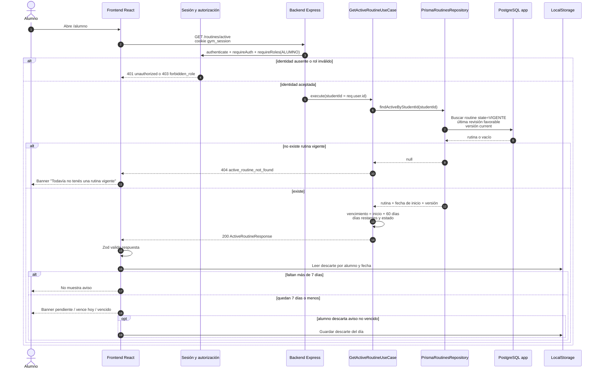

Variante entrenador/administrador: `GET /students/:studentId/routines/active` agrega validación de propiedad y, para entrenador, asignación vigente. Frontend la utiliza en la tarjeta resumida de la ficha del alumno.

## SEQ-02 — Cartera priorizada del entrenador

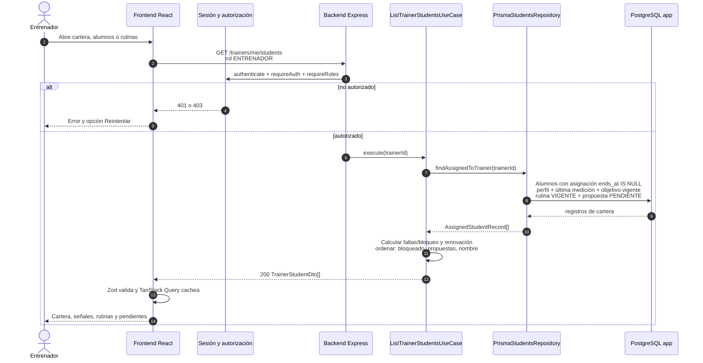

Las cajas de búsqueda y orden visibles en `/entrenador/alumnos` no participan: actualmente son sólo visuales.

## SEQ-03 — Ficha de alumno y rutina resumida

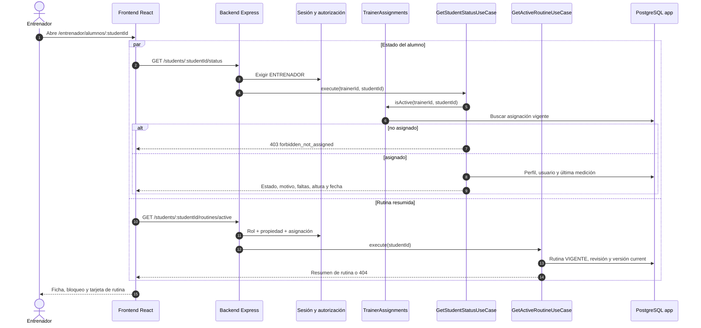

Las pestañas `Rutina` y `Mediciones` cambian la URL pero renderizan la misma ficha; no cargan estructura de rutina ni historial de mediciones.

## SEQ-04 — Desbloqueo con medición adeudada

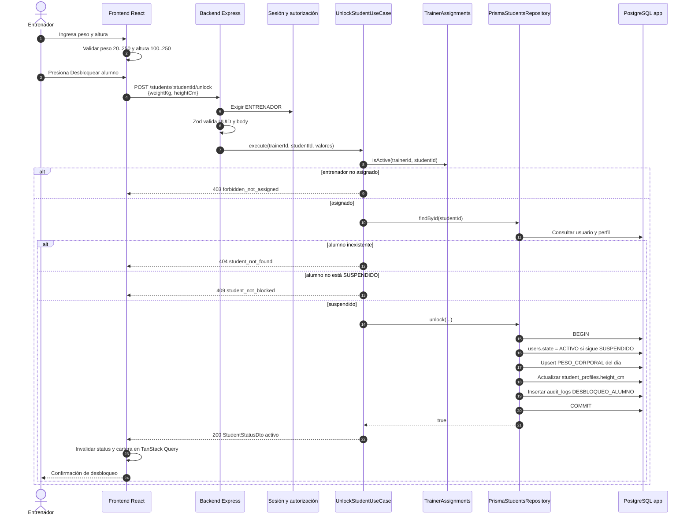

## SEQ-05 — Listado y apertura de propuestas de adaptación

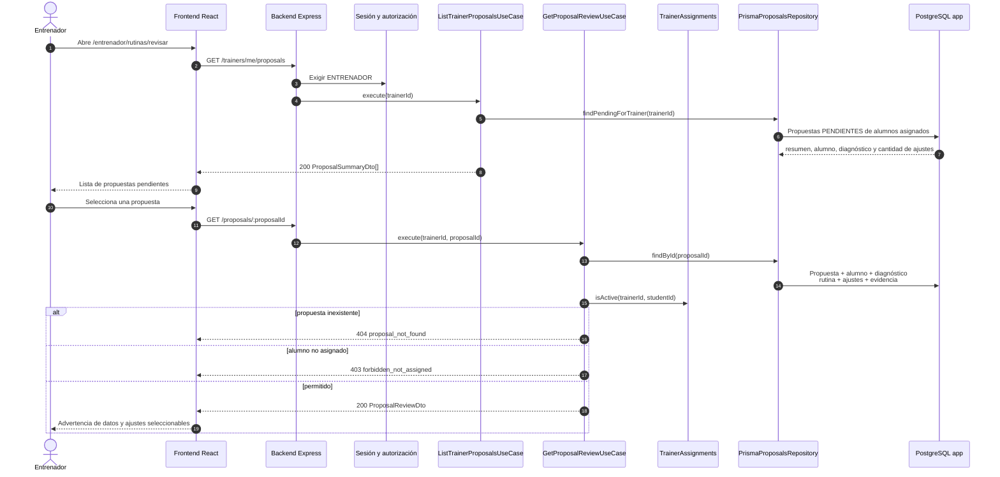

La creación automática de `evolution_diagnostics` y `adaptation_proposals` no está implementada. Este recorrido opera sobre propuestas ya existentes en PostgreSQL, incluidas las cargadas por seed de Test.

## SEQ-06 — Resolución de propuesta de adaptación

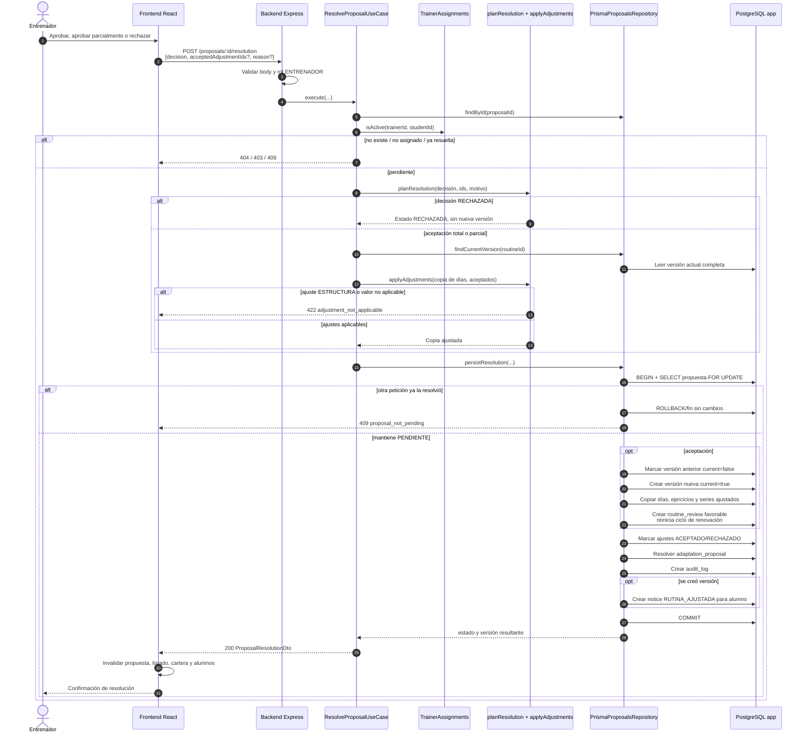

## SEQ-07 — Bloqueo por inactividad

Estado `API`: no tiene interfaz frontend.

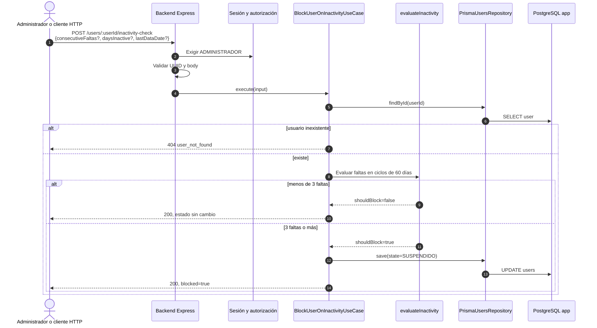

El cálculo usa valores recibidos en el request; el endpoint no deriva por sí solo la inactividad desde sesiones o mediciones.

## SEQ-08 — Consulta y finalización de generación

Estado `FRONT→API`: el panel del alumno conserva el `requestId`
por alumno en `localStorage`, recupera el seguimiento tras recargar y consulta al
backend cada tres segundos. El polling se detiene en `COMPLETADA`,
`NO_DISPONIBLE`, `CANCELADA` o ante un error HTTP; nunca consulta directamente a
IA. Una generación completa se convierte en rutina únicamente mediante una
finalización `POST` explícita e idempotente.

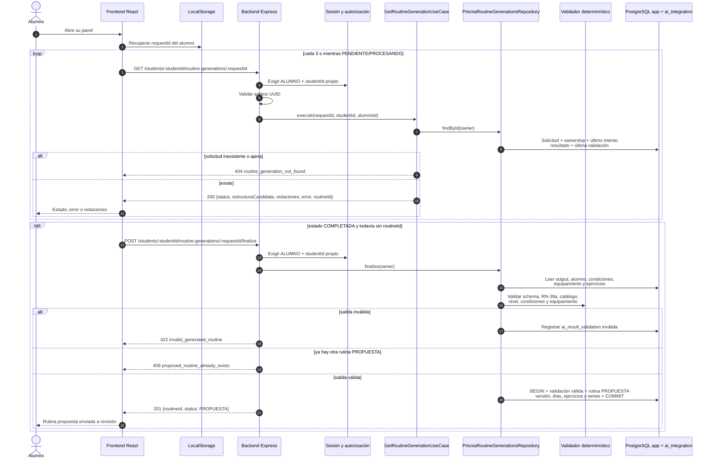

La consulta no materializa ni descarta rutinas. La mutación ocurre sólo en el
`POST /finalize`; una propuesta preexistente se conserva y produce conflicto.

## SEQ-09 — Solicitud de generación desde backend

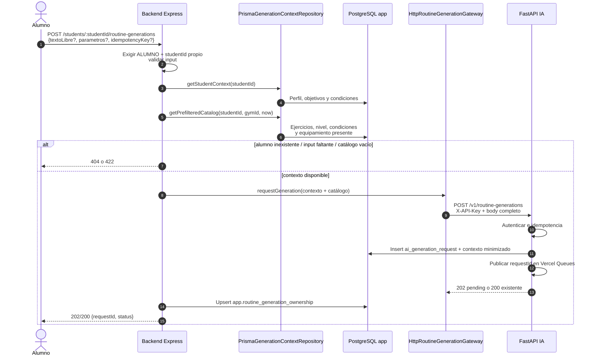

## SEQ-10 — Despacho y procesamiento implementados dentro de IA

Estado `COMPONENTE`: FastAPI acepta la solicitud, persiste el contexto minimizado,
publica el identificador y responde sin esperar al LLM.

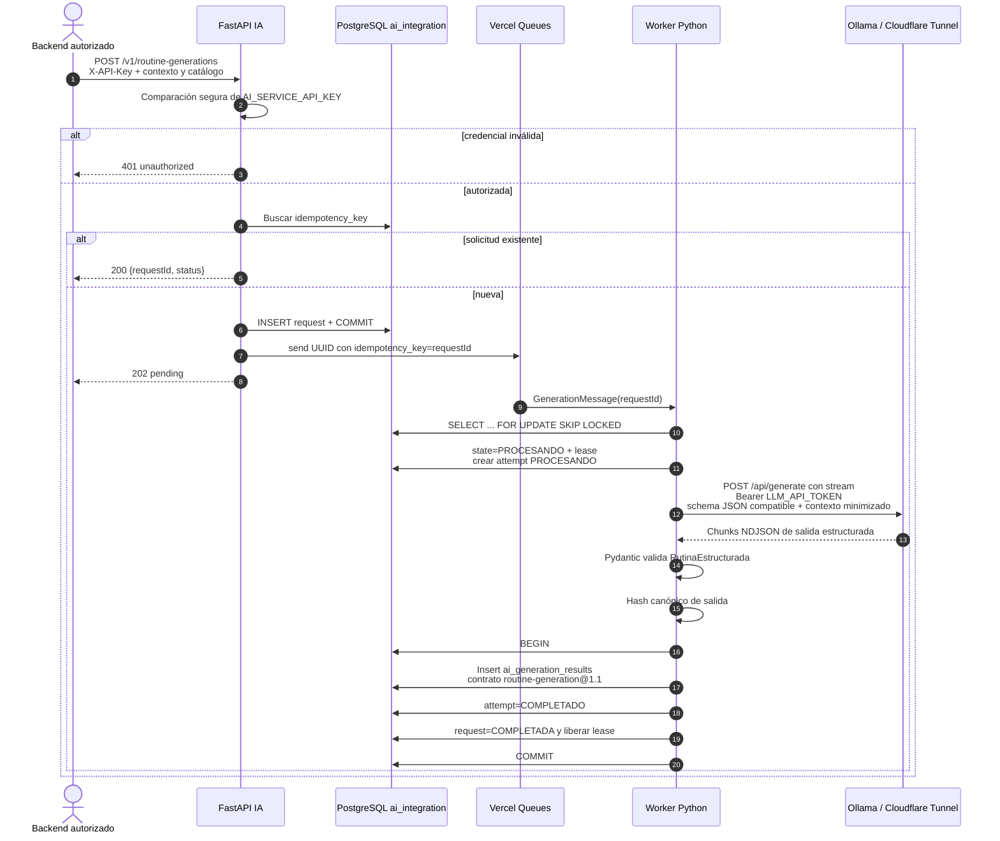

La validación de negocio y la materialización pertenecen a backend y ocurren en
SEQ-08, no dentro del worker IA.

## SEQ-11 — Falla y reintento del worker IA

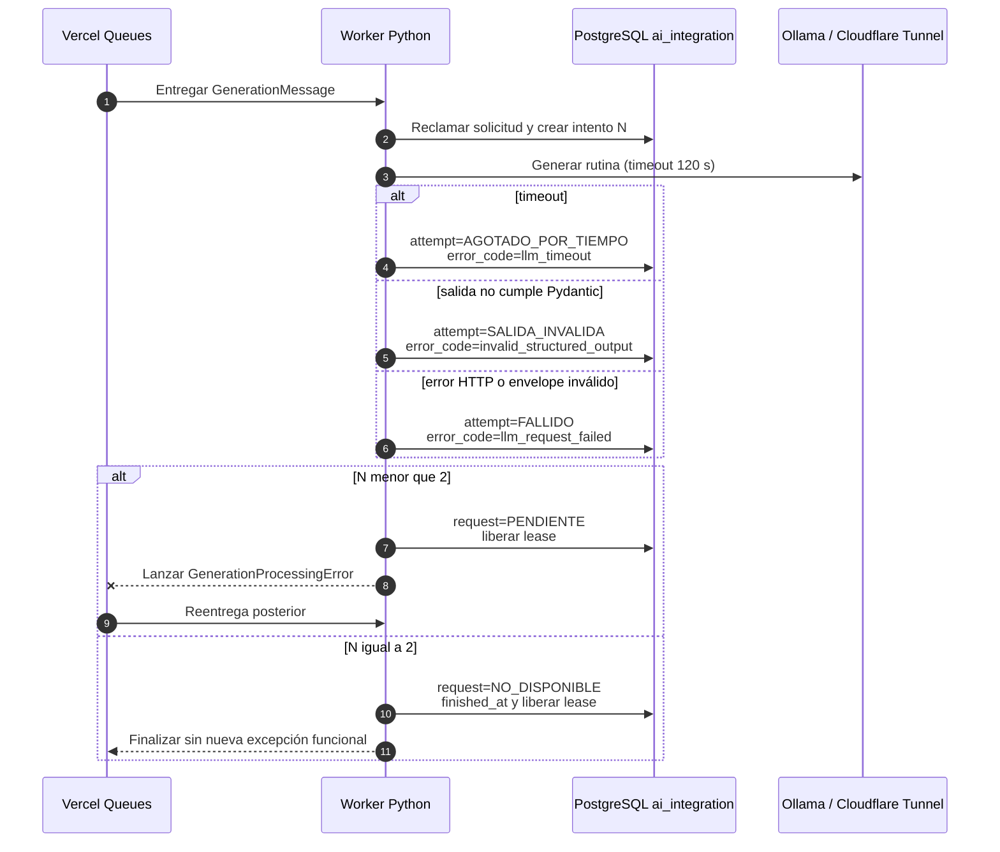

Vercel Queue está configurada con `max_attempts=6`, pero la persistencia de dominio agota la generación al segundo intento. Entregas posteriores no reclaman una solicitud `NO_DISPONIBLE`.

## SEQ-12 — Salud y readiness

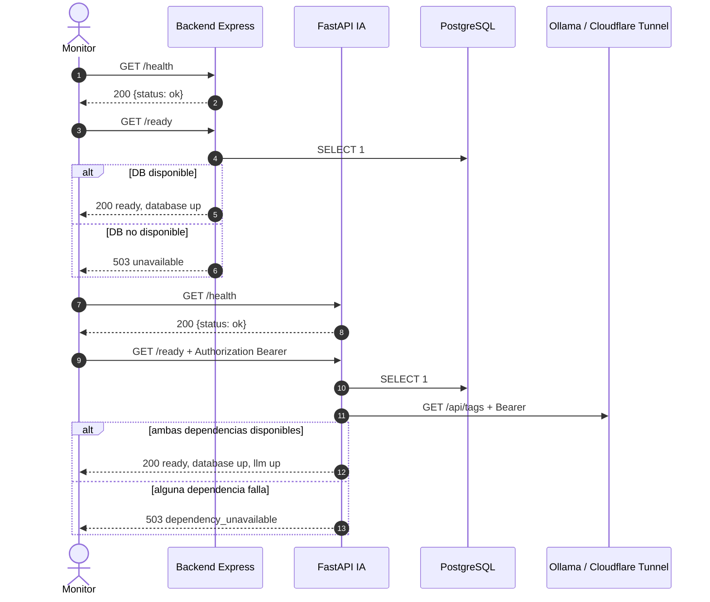

## Funcionalidades visibles que no deben tener diagrama de negocio todavía

```yaml
frontend_placeholders:
  alumno:
    - Mi rutina completa
    - Inicio y registro de sesión
    - Progreso
    - Historial
    - Catálogo
    - Perfil
  entrenador:
    - Plantillas
    - Catálogo
    - Perfil
    - Pestañas específicas de rutina y mediciones del alumno
  administrador:
    - Analítica real
    - Usuarios y roles
    - Asignaciones
    - Catálogo
    - Reglas
    - Configuración
missing_endpoints:
  - lectura de rutina con días, ejercicios y series
  - inicio, registro y cierre de sesión
  - historial y progreso
  - CRUD de usuarios, invitaciones, asignaciones, catálogo y plantillas
  - creación automática de diagnósticos y propuestas de adaptación
  - autenticación mediante sesiones propias
```

## Convenciones para trasladar a otra herramienta

- Línea continua: llamada síncrona HTTP, caso de uso o consulta directa.
- Línea discontinua: respuesta.
- Flecha asíncrona: publicación o entrega de Vercel Queues.
- Fragmento `alt`: respuesta alternativa o error observable.
- Fragmento `opt`: paso condicional sin cambiar el éxito principal.
- Marco transaccional: desde `BEGIN` hasta `COMMIT`; todo el bloque se revierte ante error.
- No conectar frontend con IA, Queue, LLM o PostgreSQL.
- Dibujar la cookie sólo entre navegador y backend; el token nunca se expone al código React ni se persiste en PostgreSQL en claro.
- No dibujar una rutina completa en SEQ-01: el endpoint actual sólo devuelve resumen y renovación.
- Mantener SEQ-09 como falla hasta alinear ruta, autenticación, payload y persistencia backend–IA.
